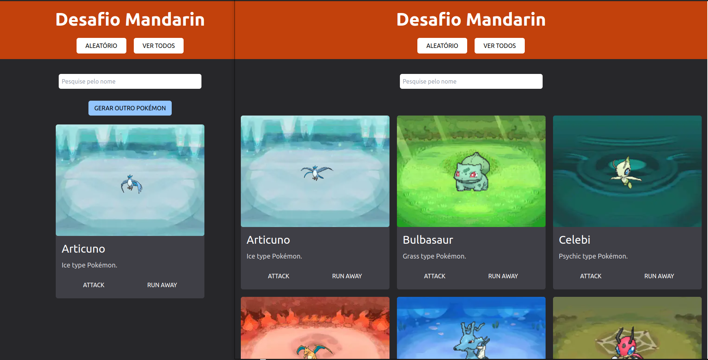

# Desafio Mandarin

Do lado esquerdo a resolução do desafio inicial, para gerar um novo pokémon e do lado direito eu quiz mostar todos os pokémons.
A barra de pesquisa funciona nos dois casos.
Além do que foi proposto, adicionei as ações de ataque e fuga. No ataque, a imagem fica um pouco maior, e na fuga, a imagem desaparece. Depois de um tempo, ambas voltam ao estado inicial.

